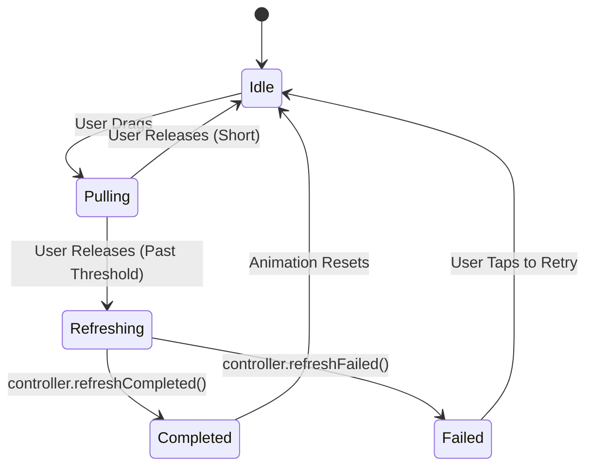

import { Aside } from '@astrojs/starlight/components';

`smart_refresher` is built on top of Flutter's `Viewport` and `Sliver` system. Unlike simpler libraries that just wrap a `Scrollable`, `smart_refresher` participates in the scroll physics to provide a truly native feel.

## How it works: The Sliver Stack

When you wrap a widget in `SmartRefresher`, it dynamically constructs a `CustomScrollView` (or similar) with the following structure:

1.  **Header Sliver**: Injected at the top. It uses a `SliverToBoxAdapter` or `SliverPlaceholder` depending on its state.
2.  **User Content**: Your list or slivers.
3.  **Footer Sliver**: Injected at the bottom.

### Scroll Physics Interaction

The library uses a custom `ScrollPhysics` (specifically `RefreshScrollPhysics`) to handle:
- **Over-scrolling**: Ensuring the bounce feels natural on iOS and dampened on Android.
- **Thresholds**: Detecting when the user has pulled far enough to "arm" the refresh trigger.
- **Ballistic Motion**: Handling high-velocity swipes that should trigger a refresh even if the user releases early.

## The Refresh Lifecycle

The `RefreshController` manages a state machine for both the head and foot:

## Two-Level Refresh

One of the unique features of `smart_refresher` is its support for "Two-Level" refreshing. This allows you to pull down once to refresh, and pull down *further* to open a secondary "floor" or "drawer" (similar to Taobao or WeChat).

- **Level 1**: Standard refresh indicators.
- **Level 2**: A secondary full-screen or expanded widget.

<Aside type="tip">
  Use `SmartRefresher.builder` if you need to completely decouple your UI from the refresh state, which is great for Clean Architecture or Bloc patterns.
</Aside>
